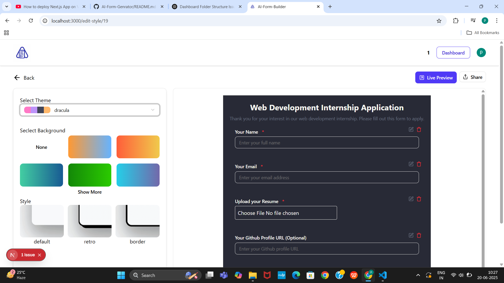
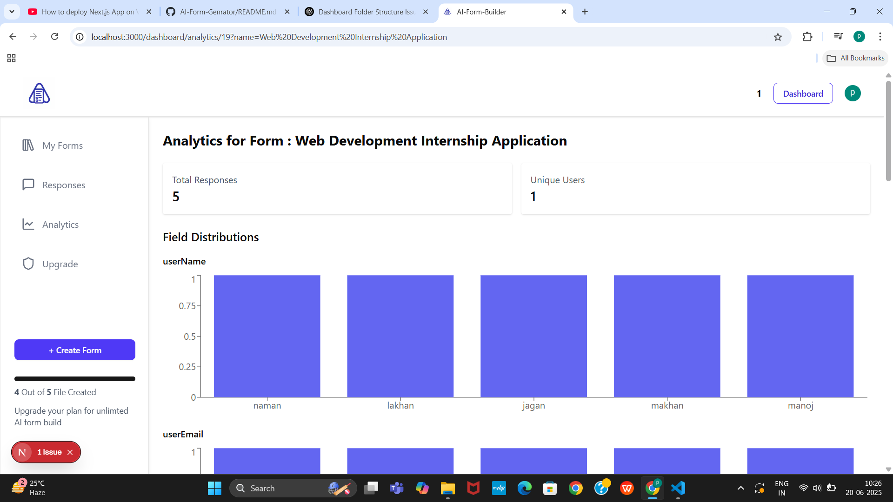
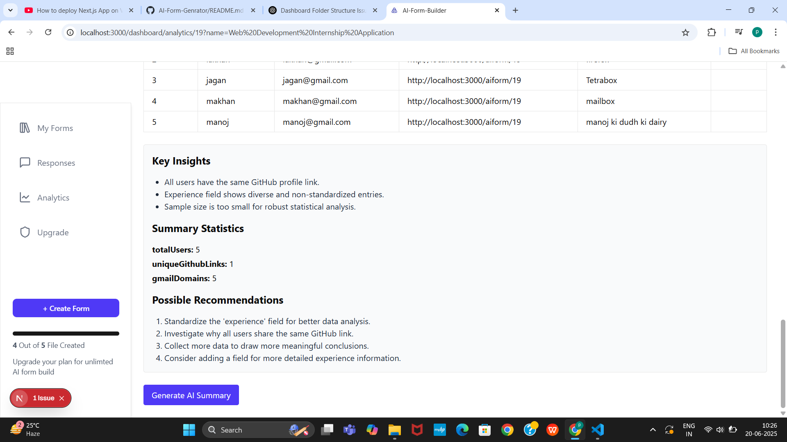
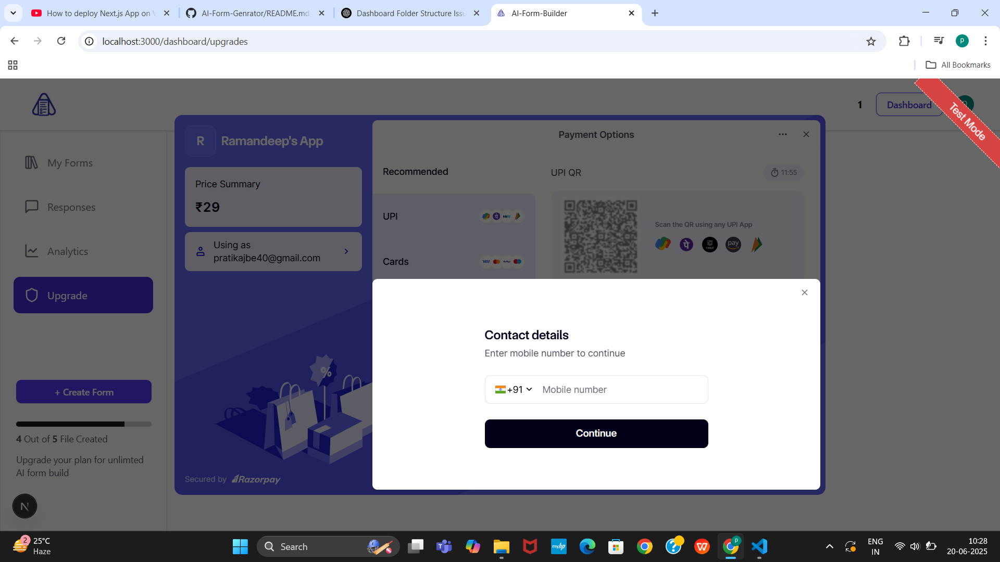

This is a [Next.js](https://nextjs.org) project bootstrapped with [`create-next-app`](https://github.com/vercel/next.js/tree/canary/packages/create-next-app).

## Getting Started

First, run the development server:

```bash
npm run dev
# or
yarn dev
# or
pnpm dev
# or
bun dev
```

Open [http://localhost:3000](http://localhost:3000) with your browser to see the result.

You can start editing the page by modifying `app/page.js`. The page auto-updates as you edit the file.

This project uses [`next/font`](https://nextjs.org/docs/app/building-your-application/optimizing/fonts) to automatically optimize and load [Geist](https://vercel.com/font), a new font family for Vercel.

# 📝 AI Form Generator

An AI-powered form builder + analytics platform built with **Next.js**, **Drizzle ORM**, **NeonDB**, and **Google Generative AI (Gemini)**.  
It allows users to:
- Dynamically create forms
- Collect and export user responses
- Visualize analytics with charts
- Generate AI-based summaries of responses
- Handle payments via Razorpay
- Use a credit system for paid features
- Switch between 35+ beautiful UI themes

---

## 🚀 Tech Stack

| Tech | Purpose |
|-------|---------|
| **Next.js 15** | Frontend framework |
| **React 19** | UI rendering |
| **TailwindCSS + DaisyUI (35+ themes)** | Styling |
| **Drizzle ORM** | Database ORM |
| **NeonDB (PostgreSQL)** | Serverless database |
| **Razorpay** | Payment & credit system integration |
| **Google Generative AI (Gemini)** | AI summaries |
| **Recharts** | Data visualization |
| **XLSX.js** | Export data to Excel |
| **Clerk** | User authentication |

---

## 📷 Demo Screenshots

| Form Builder | Analytics + Charts | AI Summary | Razorpay Integration |
|--------------|------------------|------------|---------------------|
|  |  |  |  |


---

## ⚡ Features

✅ Dynamic form creation with customizable fields  
✅ Collect and export responses to Excel  
✅ Auto-generated charts per form field  
✅ **Analytics page with AI-generated summaries (Gemini)**  
✅ **Razorpay integration for payments and credit system**  
✅ **35+ UI themes via DaisyUI**  
✅ Secure authentication (Clerk)  
✅ Unique user tracking  

---

## 💳 Credit System + Razorpay

- Users can purchase credits through Razorpay.
- Certain premium features (e.g., AI summary generation) consume credits.
- Simple & secure Razorpay checkout flow.

---

## 📂 Project Structure (Highlights)
/app
└── /dashboard
└── /analytics
└── [formId]/page.jsx → Analytics + AI summary
/configs → Drizzle + DB configs
/components → Reusable UI components


## Deploy on Vercel

The easiest way to deploy your Next.js app is to use the [Vercel Platform](https://vercel.com/new?utm_medium=default-template&filter=next.js&utm_source=create-next-app&utm_campaign=create-next-app-readme) from the creators of Next.js.

Check out our [Next.js deployment documentation](https://nextjs.org/docs/app/building-your-application/deploying) for more details.
